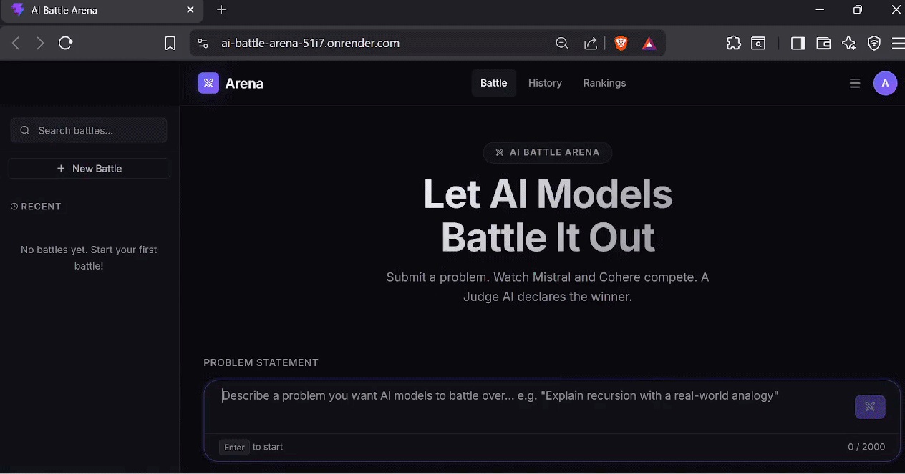
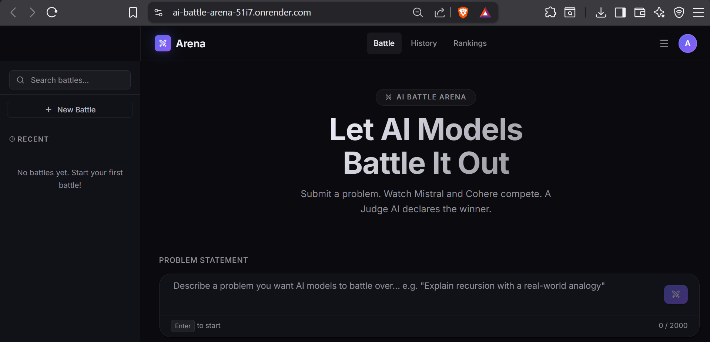
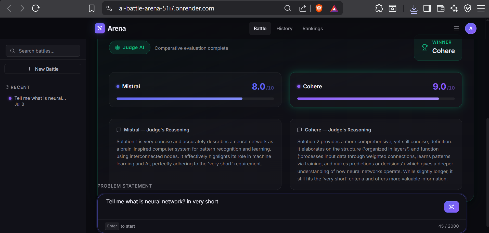
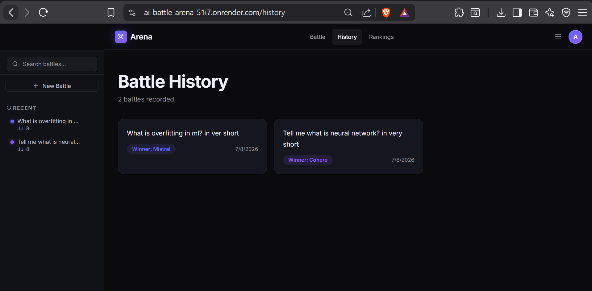
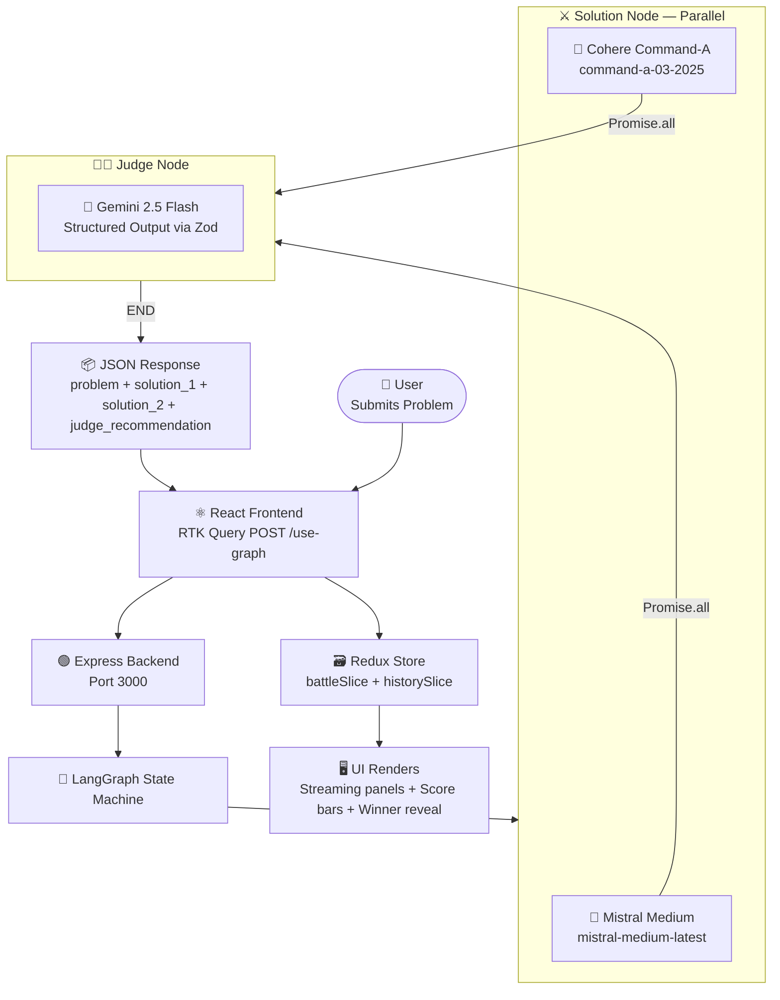

<div align="center">

<!-- BANNER -->


---

# ⚔️ AI Battle Arena

### *Submit a problem. Watch two AI models fight for the best answer. A third AI judges the winner.*

<br/>

[](https://www.typescriptlang.org/)
[](https://react.dev/)
[](https://expressjs.com/)
[](https://langchain-ai.github.io/langgraphjs/)
[](https://vite.dev/)
[](https://redux-toolkit.js.org/)
[](https://ai-battle-arena-51i7.onrender.com/)

<br/>

[🚀 Live Demo](https://ai-battle-arena-51i7.onrender.com/) &nbsp;•&nbsp; [📖 Documentation](#-table-of-contents) &nbsp;•&nbsp; [🐛 Report Bug](https://github.com/Adarsh8763/AI_Battle_Arena/issues) &nbsp;•&nbsp; [💡 Request Feature](https://github.com/Adarsh8763/AI_Battle_Arena/issues)

</div>

---

## 📋 Table of Contents

- [Overview](#-overview)
- [Live Demo](#-demo)
- [Features](#-features)
- [Tech Stack](#-tech-stack)
- [Architecture](#-architecture)
- [Project Structure](#-project-structure)
- [Installation](#-installation)
- [Environment Variables](#-environment-variables)
- [Usage](#-usage)
- [Battle Workflow](#-battle-workflow)
- [API Endpoints](#-api-endpoints)
- [Performance](#-performance)
- [Security](#-security)
- [Future Improvements](#-future-improvements)
- [Roadmap](#-roadmap)
- [Contributing](#-contributing)
- [License](#-license)
- [Author](#-author)
- [Acknowledgements](#-acknowledgements)
- [Support](#-support)

---

## 🧠 Overview

**AI Battle Arena** is a full-stack AI application that turns model benchmarking into a sport. You pose any question or problem, and two powerful language models — **Mistral** and **Cohere** — independently generate their best answer in parallel. The moment both have responded, a third AI — **Gemini 2.5 Flash** acting as an impartial judge — analyzes both answers and delivers a structured verdict: a numerical score from 0–10 for each, detailed reasoning, and a declared winner.

### Why it exists

Choosing between LLMs for a specific task is notoriously difficult. Benchmarks are static, synthetic, and rarely reflect real-world use cases. AI Battle Arena solves this by letting you run *live, head-to-head evaluations on your own prompts*, in real time. You see exactly how each model approaches your problem, and a third model tells you — with reasoning — which answer is better.

### Who should use it

- **Developers** evaluating which model to integrate into a product for a specific task type.
- **Researchers** running qualitative prompt comparisons without writing boilerplate evaluation code.
- **Curious users** who simply want to see how today's frontier models differ in reasoning, creativity, or technical depth.

> [!NOTE]
> All battle results are stored in the browser's Redux state for the session. History is searchable and supports pinning important battles for quick reference.

---

## 🎬 Demo

### 🌐 Live Application

**➜ [https://ai-battle-arena-51i7.onrender.com/](https://ai-battle-arena-51i7.onrender.com/)**

> [!IMPORTANT]
> The backend is hosted on Render's free tier and may take up to **30 seconds to cold start** if it has not been used recently. The first battle request will trigger the wake-up. Subsequent requests are fast.

### 📽️ Video Walkthrough

<p align="center">
  
</p>

## 🖼️ Screenshots

### 🏠 Battle Arena

<p align="center">
  
</p>

---

### 🧑‍⚖️ Judge Results

<p align="center">
  
</p>

---

### 📜 Battle History

<p align="center">
  
</p>

---

## ✨ Features

- **⚔️ Side-by-Side AI Battle** — Mistral and Cohere generate independent answers to your problem simultaneously, displayed in a split-panel arena layout so you can compare them naturally.

- **🎯 Simulated Streaming Output** — Responses arrive and are rendered character-by-character with an animated cursor, giving the experience of live streaming even from a non-streaming API endpoint.

- **🧑‍⚖️ Structured AI Judge** — Gemini 2.5 Flash evaluates both responses using Zod-enforced structured output. The verdict includes a 0–10 numerical score and written reasoning for each model — not just a winner declaration.

- **🏆 Animated Winner Reveal** — The winning panel is highlighted with a spring-animated winner badge and trophy icon. Score bars animate from 0 to their final values using a smooth cubic-bezier easing.

- **📜 Searchable Battle History** — Every completed battle is saved to the session's Redux store. The slide-in sidebar lists all past battles, filterable by keyword, with the ability to pin important ones to the top.

- **📊 Visual Score Bars** — Each judge score is visualized as an animated progress bar, making it immediately obvious which model dominated on a given problem.

- **🔄 Skeleton Loading States** — While the backend is processing, intelligent skeleton loaders fill each panel so the interface never feels empty or broken.

- **📐 Responsive Layout** — The sidebar is toggleable. The main content area adjusts with a smooth CSS transition, accommodating both focused single-column and expanded multi-column views.

- **🔔 Toast Notification System** — A global toast system (via Redux) surfaces errors and status updates without blocking the main UI.

- **⌨️ Keyboard-First Input** — Press `Enter` to launch a battle directly from the textarea. `Shift+Enter` inserts a newline. The textarea auto-resizes up to 340px.

---

## 🛠️ Tech Stack

### Frontend

| Technology | Version | Purpose |
|---|---|---|
| [React](https://react.dev/) | 19 | UI component framework |
| [TypeScript](https://www.typescriptlang.org/) | 6.0 | Static typing across the entire frontend |
| [Vite](https://vite.dev/) | 8 | Build tool & dev server |
| [Redux Toolkit](https://redux-toolkit.js.org/) | 2 | Global state management (battle, history, UI) |
| [RTK Query](https://redux-toolkit.js.org/rtk-query/overview) | 2 | Data-fetching & API cache layer |
| [React Router DOM](https://reactrouter.com/) | 7 | Client-side routing |
| [Framer Motion](https://www.framer.com/motion/) | 12 | Animations, transitions, and spring physics |
| [React Markdown](https://github.com/remarkjs/react-markdown) | 10 | Renders AI markdown responses safely |
| [React Syntax Highlighter](https://github.com/react-syntax-highlighter/react-syntax-highlighter) | 16 | Code block syntax highlighting in responses |
| [Lucide React](https://lucide.dev/) | 1.14 | Icon set |
| [Sass](https://sass-lang.com/) | 1.99 | CSS modules & scoped component styling |

### Backend

| Technology | Version | Purpose |
|---|---|---|
| [Node.js](https://nodejs.org/) | — | JavaScript runtime |
| [Express](https://expressjs.com/) | 5 | HTTP server & API routing |
| [TypeScript](https://www.typescriptlang.org/) | 6.0 | Static typing |
| [tsx](https://github.com/privatenumber/tsx) | 4 | TypeScript execution in development (no build step) |

### AI / LLM Orchestration

| Technology | Version | Purpose |
|---|---|---|
| [LangGraph](https://langchain-ai.github.io/langgraphjs/) | 1.3 | Stateful multi-agent graph orchestration |
| [LangChain Core](https://js.langchain.com/) | 1.1 | Shared primitives (HumanMessage, etc.) |
| [LangChain Google](https://js.langchain.com/docs/integrations/chat/google_generativeai) | 0.1 | Gemini 2.5 Flash (Judge model) |
| [LangChain MistralAI](https://js.langchain.com/docs/integrations/chat/mistral) | 1.0 | Mistral Medium (Competitor 1) |
| [LangChain Cohere](https://js.langchain.com/docs/integrations/chat/cohere) | 1.0 | Cohere Command-A (Competitor 2) |
| [Zod](https://zod.dev/) | 4 | Schema validation & structured AI output enforcement |

### Deployment & DevOps

| Technology | Purpose |
|---|---|
| [Render](https://render.com/) | Full-stack hosting (backend serves the built frontend as static files) |
| [dotenv](https://github.com/motdotla/dotenv) | Environment variable management |
| [ESLint](https://eslint.org/) | Code quality & linting |

---

## 🏗️ Architecture

AI Battle Arena follows a **monorepo structure** with a decoupled frontend and backend. The backend is the only deployed server — it serves the compiled frontend as static files from the `/public` directory. The frontend communicates with the backend via a single REST endpoint.

The core intelligence lives in a **LangGraph state machine** that orchestrates three AI models in a directed pipeline. The graph has two nodes — a parallel solution node and a sequential judge node — connected by deterministic edges.



### State Machine Flow

The LangGraph graph defines a strict pipeline with no conditional branching:

```
START → solution (parallel) → judge (sequential) → END
```

1. **`solution` node**: Invokes Mistral and Cohere simultaneously using `Promise.all`. Both see the exact same problem string. The node returns `{ solution_1, solution_2 }` which are merged into the shared state.

2. **`judge` node**: Receives the full state (problem + both solutions). It creates a structured agent backed by Gemini 2.5 Flash with a Zod schema enforcing `{ solution_1_score, solution_2_score, solution_1_resoning, solution_2_resoning }`. The response is guaranteed to be parseable — no hallucinated formats.

### Frontend Data Flow

The frontend simulates streaming by replaying the response character-by-character through Redux actions:

```
API Response received
    → dispatch appendSolution1(char) × N  [5ms delay per char]
    → dispatch setSolution1Done()
    → dispatch appendSolution2(char) × N  [5ms delay per char]
    → dispatch setSolution2Done()
    → dispatch setJudgeResult(recommendation)
    → dispatch addRecord(battleRecord)   ← saves to history
```

---

## 📁 Project Structure

```
AI_Battle_Arena_backend_136/
│
├── Backend/                         # Node.js / Express API server
│   ├── server.ts                    # Entry point — starts server on port 3000
│   ├── package.json
│   ├── tsconfig.json
│   ├── .env                         # API keys (never commit this)
│   ├── public/                      # Built frontend assets (served as static files)
│   └── src/
│       ├── app.ts                   # Express app — routes & middleware
│       ├── config/
│       │   └── config.ts            # Typed environment variable loader
│       └── services/
│           ├── model.service.ts     # LangChain model instantiation (Gemini, Mistral, Cohere)
│           └── graph.ai.service.ts  # LangGraph state machine definition & export
│
└── Frontend/                        # React + Vite SPA
    ├── index.html
    ├── vite.config.ts
    ├── package.json
    ├── tsconfig.json
    ├── tsconfig.app.json
    ├── tsconfig.node.json
    ├── eslint.config.js
    ├── .gitignore
    ├── .env                         # VITE_API_URL
    └── src/
        ├── main.tsx                 # React root mount
        ├── vite-env.d.ts
        ├── app/
        │   ├── App.tsx              # Provider wrapper (Redux, Router)
        │   ├── AppRoutes.tsx        # Route definitions + layout shell
        │   ├── store.ts             # Redux store configuration
        │   └── uiSlice.ts           # Global UI state (sidebar, toasts)
        ├── features/
        │   ├── battle/
        │   │   ├── battleSlice.ts            # Core battle state machine
        │   │   ├── hooks/
        │   │   │   └── useBattle.ts          # Orchestrates full battle lifecycle
        │   │   ├── services/
        │   │   │   └── battleApi.ts          # RTK Query API definitions
        │   │   ├── components/
        │   │   │   ├── BattleArena.tsx       # Split-panel arena layout
        │   │   │   └── PromptInput.tsx       # Auto-resizing prompt textarea
        │   │   ├── pages/
        │   │   │   └── BattlePage.tsx        # Main battle page
        │   │   └── styles/                   # SCSS modules for battle feature
        │   │       ├── BattleArena.module.scss
        │   │       ├── BattlePage.module.scss
        │   │       └── PromptInput.module.scss
        │   ├── history/
        │   │   ├── historySlice.ts           # Battle history (records, search, pin)
        │   │   ├── pages/
        │   │   │   └── HistoryPage.tsx
        │   │   └── styles/
        │   │       └── HistoryPage.module.scss
        │   └── judge/
        │       ├── components/
        │       │   └── JudgeSection.tsx      # Score bars + reasoning cards
        │       └── styles/
        │           └── JudgeSection.module.scss
        ├── shared/
        │   ├── components/
        │   │   ├── layout/
        │   │   │   ├── Navbar.tsx            # Top navigation bar
        │   │   │   ├── Navbar.module.scss
        │   │   │   ├── Sidebar.tsx           # Collapsible history sidebar
        │   │   │   └── Sidebar.module.scss
        │   │   └── ui/
        │   │       ├── Button.tsx            # Reusable button component
        │   │       └── Button.module.scss
        │   ├── hooks/
        │   │   └── useAppStore.ts            # Typed Redux hooks
        │   └── types/
        │       └── index.ts                  # All shared TypeScript interfaces
        ├── assets/
        │   ├── hero.png
        │   └── vite.svg
        └── styles/                           # Global CSS variables & resets
            ├── base/
            │   └── _global.css
            ├── mixins/
            │   └── _index.scss
            └── tokens/
                └── _variables.scss
```

---

## 🚀 Installation

### Prerequisites

- **Node.js** >= 18.0.0
- **npm** >= 9.0.0
- API keys for [Google AI Studio](https://aistudio.google.com/), [Mistral AI](https://console.mistral.ai/), and [Cohere](https://dashboard.cohere.com/)

### 1. Clone the Repository

```bash
git clone https://github.com/Adarsh8763/Backend_Cohort2.0.git/
cd Backend_Cohort2.0/AI_Battle_Arena_backend_136
```

### 2. Install Backend Dependencies

```bash
cd Backend
npm install
```

### 3. Configure Backend Environment Variables

Create a `.env` file in the `Backend/` directory:

```env
GOOGLE_API_KEY=your_google_ai_studio_api_key
MISTRAL_API_KEY=your_mistral_api_key
COHERE_API_KEY=your_cohere_api_key
```

### 4. Install Frontend Dependencies

```bash
cd ../Frontend
npm install
```

### 5. Configure Frontend Environment Variables

Create a `.env` file in the `Frontend/` directory:

```env
VITE_API_URL=http://localhost:3000/
```

> [!NOTE]
> For production, set `VITE_API_URL` to your deployed backend URL, e.g. `https://ai-battle-arena-51i7.onrender.com/`.

### 6. Run the Backend

```bash
# From the Backend/ directory
npm run dev
# Server starts at http://localhost:3000
```

### 7. Run the Frontend

```bash
# From the Frontend/ directory (new terminal)
npm run dev
# App opens at http://localhost:5173
```

---

## 🔐 Environment Variables

### Backend (`Backend/.env`)

| Variable | Required | Description |
|---|---|---|
| `GOOGLE_API_KEY` | ✅ Yes | Google AI Studio key. Used by Gemini 2.5 Flash (judge model). Get it at [aistudio.google.com](https://aistudio.google.com/). |
| `MISTRAL_API_KEY` | ✅ Yes | Mistral AI platform key. Used by `mistral-medium-latest`. Get it at [console.mistral.ai](https://console.mistral.ai/). |
| `COHERE_API_KEY` | ✅ Yes | Cohere platform key. Used by `command-a-03-2025`. Get it at [dashboard.cohere.com](https://dashboard.cohere.com/). |

### Frontend (`Frontend/.env`)

| Variable | Required | Description |
|---|---|---|
| `VITE_API_URL` | ✅ Yes | Base URL of the backend API. Use `http://localhost:3000/` for local dev. |

> [!CAUTION]
> Never commit your `.env` files to version control. Your API keys grant access to paid AI model APIs.

---

## 🎮 Usage

1. **Open the app** at `http://localhost:5173` (dev) or the deployed URL.
2. **Type or paste a problem** into the input field at the bottom of the screen. This can be any question, coding challenge, explanation request, or debate topic.
3. **Press `Enter`** (or click the ⚔️ button) to start the battle.
4. Watch **Mistral's response stream in** on the left panel with an animated cursor.
5. Watch **Cohere's response stream in** on the right panel.
6. The **Judge AI panel slides up** showing an analyzing skeleton while Gemini processes both responses.
7. **Score bars animate** to their final values. The winner is announced with a trophy badge.
8. Click **"Start New Battle"** to reset and try another problem.
9. Open the **sidebar** (top-left toggle) to browse your battle history, search past battles, or pin important ones.

---

## ⚡ Battle Workflow

This is the complete end-to-end request lifecycle:

```
1. USER types a problem and presses Enter
        ↓
2. FRONTEND dispatches setProblem() + startBattle()
   → Status: 'generating_solution_1', streamingModel: 1
        ↓
3. RTK Query fires POST /use-graph { problem: "..." }
        ↓
4. BACKEND receives request → invokes LangGraph
        ↓
5. LangGraph: solution node (START → solution)
   → Promise.all([mistralModel.invoke(), cohereModel.invoke()])
   → Both models generate responses in PARALLEL
        ↓
6. LangGraph: judge node (solution → judge)
   → Gemini 2.5 Flash reads problem + solution_1 + solution_2
   → Returns structured JSON { scores, reasoning } via Zod schema
        ↓
7. BACKEND returns: { message, result: { problem, solution_1, solution_2, judge_recommendation } }
        ↓
8. FRONTEND receives full result, begins character-by-character replay:
   → Streams solution_1 → Status: 'generating_solution_1'
   → setSolution1Done() → Status: 'generating_solution_2'
   → Streams solution_2 → Status: 'generating_solution_2'
   → setSolution2Done() → Status: 'judging'
   → setJudgeResult() → Status: 'complete'
        ↓
9. WINNER is computed (higher score wins, null on tie)
   → addRecord() saves battle to history sidebar
```

---

## 📡 API Endpoints

| Method | Endpoint | Description | Request Body | Response |
|---|---|---|---|---|
| `POST` | `/use-graph` | Submit a problem. Runs the full LangGraph pipeline and returns the complete result. | `{ "problem": string }` | `{ "message": string, "result": BattleState }` |
| `GET` | `/battle/history` | *(Planned)* Retrieve a list of past battle records. | — | `BattleState[]` |
| `GET` | `/battle/:id` | *(Planned)* Retrieve a single battle by ID. | — | `BattleState` |
| `GET` | `*` | Catch-all. Serves the compiled React SPA for client-side routing support. | — | `text/html` |

### Example Request

```bash
curl -X POST https://ai-battle-arena-51i7.onrender.com/use-graph \
  -H "Content-Type: application/json" \
  -d '{"problem": "Explain the difference between TCP and UDP like I am five years old"}'
```

### Example Response

```json
{
  "message": "Graph invoked successfully",
  "result": {
    "problem": "Explain the difference between TCP and UDP like I am five years old",
    "solution_1": "...",
    "solution_2": "...",
    "judge_recommendation": {
      "solution_1_score": 8.5,
      "solution_2_score": 7.2,
      "solution_1_resoning": "Mistral's analogy was clearer and age-appropriate...",
      "solution_2_resoning": "Cohere provided accurate information but used technical terms..."
    }
  }
}
```

---

## ⚙️ Performance

- **Parallel model inference**: The biggest latency win. Both Mistral and Cohere are called simultaneously via `Promise.all`, meaning total wait time is `max(mistral_latency, cohere_latency)` rather than the sum. Typical end-to-end time is 8–15 seconds for medium-complexity prompts.

- **Lazy-loaded routes**: Both `BattlePage` and `HistoryPage` are wrapped in `React.lazy()` + `Suspense`, so only the page's JS bundle is fetched when first navigated to.

- **CSS Modules with SCSS**: All styles are scoped locally. No global class pollution, minimal specificity wars, and zero unused CSS at runtime.

- **Framer Motion `AnimatePresence`**: Exit animations are offloaded to the animation library, preventing layout shifts when components unmount.

- **Character streaming at 5ms/char**: The simulated streaming adds perceived liveliness. The UI remains interactive throughout — the Redux store updates incrementally, not in one large batch flush.

---

## 🔒 Security

- **API key isolation**: All three LLM API keys live exclusively on the backend in environment variables, loaded via `dotenv`. They are never exposed to the client.

- **CORS restriction**: The Express server explicitly whitelists `https://ai-battle-arena-51i7.onrender.com/` as the only allowed origin in production.

- **Input length capping**: The frontend enforces a hard 2,000-character limit on the problem input, preventing oversized payloads from reaching the backend.

- **Zod schema enforcement**: The judge's response is validated through a Zod schema before being returned to the client. Malformed or hallucinated JSON from the LLM is caught at the schema layer.

- **No database, no PII**: The current implementation stores all battle history in browser memory (Redux state). No user data is persisted to any external service.

> [!WARNING]
> The `/use-graph` endpoint has no authentication or rate limiting in the current implementation. Adding an API key header or basic auth is strongly recommended before sharing the backend URL publicly.

---

## 🔮 Future Improvements

- **Real-time streaming via SSE/WebSocket**: Replace the simulated character replay with actual Server-Sent Events from the backend, so the client sees tokens as the LLM generates them.

- **Persistent battle history**: Connect a database (PostgreSQL via Prisma or MongoDB) so battle records survive page refreshes and can be shared via unique URLs.

- **More competitor models**: Add GPT-4o, Claude Sonnet, Llama 3, or DeepSeek as selectable competitors.

- **Custom judge**: Allow the user to switch the judge model or customize evaluation criteria.

- **Battle export**: Download battle results as a formatted PDF or markdown file.

- **Rate limiting & authentication**: Protect the API with JWT auth and per-user rate limits to prevent abuse.

- **Community leaderboard**: Track model win rates across all submitted problems and surface aggregate statistics.

---

## 🗺️ Roadmap

**Phase 1 — Core (✅ Complete)**

- [x] LangGraph parallel solution pipeline
- [x] Gemini-powered structured judge with Zod schema
- [x] React frontend with side-by-side battle arena
- [x] Simulated character-by-character streaming
- [x] Animated score bars and winner reveal
- [x] Searchable & pinnable battle history sidebar
- [x] Deployed on Render (backend serves frontend as static files)

**Phase 2 — Streaming & Persistence (🚧 In Progress)**

- [ ] True SSE streaming from backend to client
- [ ] PostgreSQL / MongoDB for persistent history
- [ ] User authentication
- [ ] Shareable battle result URLs

**Phase 3 — Ecosystem (📅 Planned)**

- [ ] Model selector (GPT-4o, Claude, Llama 3, DeepSeek)
- [ ] Custom judge criteria
- [ ] Community leaderboard & win-rate statistics
- [ ] Battle export (PDF / Markdown)
- [ ] Prompt template library

---

## 🤝 Contributing

Contributions are what make open-source worth building. Any improvements you bring are genuinely appreciated.

### Getting Started

1. **Fork** the repository on GitHub.
2. **Clone** your fork locally:
   ```bash
   git clone https://github.com/Adarsh8763/Backend_Cohort2.0.git/
   cd Backend_Cohort2.0/AI_Battle_Arena_backend_136
   ```
3. **Create a feature branch**:
   ```bash
   git checkout -b feature/your-feature-name
   ```
4. **Make your changes**, following the code style already established in the project.
5. **Commit** with a clear, descriptive message:
   ```bash
   git commit -m "feat: add SSE streaming support to /use-graph endpoint"
   ```
6. **Push** to your fork:
   ```bash
   git push origin feature/your-feature-name
   ```
7. **Open a Pull Request** against the `main` branch.

### Commit Convention

| Prefix | When to use |
|---|---|
| `feat:` | A new feature |
| `fix:` | A bug fix |
| `docs:` | Documentation only changes |
| `style:` | Formatting, whitespace, no logic change |
| `refactor:` | Code change that neither fixes a bug nor adds a feature |
| `perf:` | A code change that improves performance |
| `chore:` | Build process or tooling changes |

> [!NOTE]
> Please open an issue before submitting a large PR so we can discuss the approach first. Small bug fixes and documentation improvements can go straight to a PR.

---

## 📄 License

This project is licensed under the **ISC License**.

```
ISC License

Copyright (c) 2026 Adarsh

Permission to use, copy, modify, and/or distribute this software for any purpose
with or without fee is hereby granted, provided that the above copyright notice
and this permission notice appear in all copies.
```

---

## 👤 Author

<div align="center">

**Adarsh**

Built during Cohort 2.0 as a hands-on exploration of LangGraph multi-agent orchestration,
real-time React UI patterns, and production-grade full-stack deployment.

[](https://github.com/Adarsh8763)

</div>

---

## 🙏 Acknowledgements

This project stands on the shoulders of some remarkable open-source work:

- **[LangChain / LangGraph](https://github.com/langchain-ai/langgraphjs)** — For making multi-agent AI orchestration feel like composing functions rather than fighting APIs.
- **[Framer Motion](https://www.framer.com/motion/)** — For making buttery-smooth animations accessible without a physics degree.
- **[Redux Toolkit](https://redux-toolkit.js.org/)** — For turning Redux from painful boilerplate into something you actually enjoy writing.
- **[Mistral AI](https://mistral.ai/)**, **[Cohere](https://cohere.com/)**, and **[Google DeepMind](https://deepmind.google/)** — For the incredible language models that power this arena.
- **[Render](https://render.com/)** — For free-tier hosting that actually works.

---

## 💬 Support

Have a question, found a bug, or want to suggest something?

- 🐛 **Bug Reports**: [Open an Issue](https://github.com/Adarsh8763/Backend_Cohort2.0/issues)
- 💡 **Feature Requests**: [Open an Issue](https://github.com/Adarsh8763/Backend_Cohort2.0/issues) with the `enhancement` label
- 📧 **Direct contact**: Open a GitHub Issue

---

## ⭐ Star the Repository

If AI Battle Arena made you think differently about how to evaluate LLMs, or if you just think the idea is cool — a star genuinely helps this project get discovered by others.

<div align="center">

**[⭐ Star this repository on GitHub](https://github.com/Adarsh8763/Backend_Cohort2.0)**

*Every star means a developer somewhere will find this project and maybe build something better with it.*

</div>

---

<div align="center">


**Built with ⚔️ and a lot of API credits.**

*May the best model win.*

</div>
